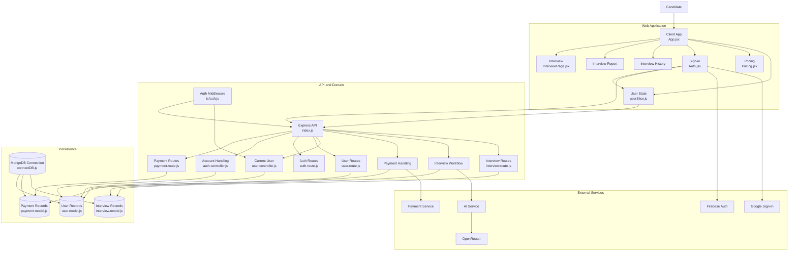

# AI Interview Platform

An AI-powered interview web application where a candidate can sign in,
take interviews, view interview reports and history, manage
credits/payments, and use AI-powered interview analysis.

## Table of Contents

1.  [Project Overview](#project-overview)
2.  [Key Features](#key-features)
3.  [System Architecture](#system-architecture)
4.  [Architecture Layers](#architecture-layers)
5.  [Application Flow](#application-flow)
6.  [Frontend Structure](#frontend-structure)
7.  [Backend Structure](#backend-structure)
8.  [Database and Persistence](#database-and-persistence)
9.  [External Services](#external-services)
10. [Authentication Flow](#authentication-flow)
11. [Interview Flow](#interview-flow)
12. [Payment and Credit Flow](#payment-and-credit-flow)
13. [AI Analysis Flow](#ai-analysis-flow)
14. [Installation and Setup](#installation-and-setup)
15. [Environment Variables](#environment-variables)
16. [Running the Project](#running-the-project)
17. [API and Module Responsibilities](#api-and-module-responsibilities)
18. [Recommended Project Structure](#recommended-project-structure)
19. [Troubleshooting](#troubleshooting)
20. [Future Improvements](#future-improvements)

------------------------------------------------------------------------

## Project Overview

The **AI Interview Platform** is a full-stack web application designed
to help candidates practice interviews and understand their performance.

The application is divided into four major areas:

-   **Frontend / Web Application** -- React client and page routing.
-   **Backend / API** -- Express API, authentication middleware,
    controllers, routes, and business workflows.
-   **Persistence** -- MongoDB and application data models.
-   **External Services** -- Firebase Authentication, Google Sign-In,
    Razorpay, and AI services through OpenRouter.

### Main user journey

``` text
Candidate
   |
   v
React Client
   |
   +--> Sign In
   |
   +--> Interview
   |       |
   |       v
   |    Interview Workflow
   |       |
   |       v
   |    AI Service
   |
   +--> Interview Report
   |
   +--> Interview History
   |
   +--> Pricing / Credits
           |
           v
        Razorpay
```

------------------------------------------------------------------------

# System Architecture

The repository contains an architecture diagram based on the supplied
system design:


### Mermaid version

GitHub can render the following Mermaid diagram directly:



------------------------------------------------------------------------

# Architecture Layers

## 1. Candidate Layer

The candidate is the end user of the platform.

The candidate can:

1.  Sign in.
2.  Access the interview application.
3.  Start an interview.
4.  Submit interview information.
5.  Receive AI-based analysis.
6.  View interview reports.
7.  Review previous interviews.
8.  Purchase or manage credits through the pricing/payment flow.

------------------------------------------------------------------------

## 2. Web Application Layer

The frontend is represented by the **Client App (`App.jsx`)**.

The client controls navigation between the main application pages:

  Page                  Responsibility
  --------------------- -------------------------------------
  `InterviewPage.jsx`   Interview experience
  Interview Report      Displays interview analysis/results
  Interview History     Displays previous interviews
  `Auth.jsx`            Sign-in/authentication UI
  `Pricing.jsx`         Pricing and credit purchase UI
  `userSlice.js`        Global/current user state

### Frontend flow

``` text
App.jsx
   |
   +---- Interview
   |
   +---- Interview Report
   |
   +---- Interview History
   |
   +---- Sign In
   |
   +---- Pricing
   |
   +---- User State
```

------------------------------------------------------------------------

# Backend Structure

The backend is built around an **Express API**.

The main entry point shown in the architecture is:

``` text
index.js
```

It connects the HTTP layer with routes, middleware, controllers, payment
handling, interview workflow, and persistence.

## Backend responsibilities

### `index.js`

Acts as the Express application entry point.

Typical responsibilities:

-   Create the Express application.
-   Register middleware.
-   Connect API routes.
-   Enable required security/CORS/body parsing middleware.
-   Start the server.

### `isAuth.js`

Authentication middleware.

Typical responsibility:

``` text
Request
   |
   v
Authentication Middleware
   |
   +---- Valid user ---> Controller
   |
   +---- Invalid user -> Unauthorized response
```

### Authentication routes

``` text
auth.route.js
```

Handles authentication-related API endpoints.

### User routes

``` text
user.route.js
```

Handles user-related operations.

### Current user controller

``` text
user.controller.js
```

Used for retrieving or updating the currently authenticated user's
information.

### Interview routes

``` text
interview.route.js
```

Handles interview-related requests.

### Payment routes

``` text
payment.route.js
```

Handles payment-related API requests.

------------------------------------------------------------------------

# Database and Persistence

The architecture uses MongoDB as the main persistence layer.

The diagram contains the following data areas:

## User Records

``` text
user.model.js
```

Stores user-related application data.

Typical data can include:

-   User identity
-   Account information
-   Credits
-   Authentication-related references
-   Application preferences

> Keep the actual fields synchronized with the model used in the
> project.

------------------------------------------------------------------------

## Payment Records

``` text
payment.model.js
```

Stores payment/order-related information.

Typical responsibilities:

-   Store payment/order references.
-   Store purchased credits.
-   Track payment status.
-   Associate payments with users.

------------------------------------------------------------------------

## Interview Records

``` text
interview.model.js
```

Stores interview-related information.

Possible data includes:

-   Interview details
-   Questions/responses
-   Analysis
-   Scores or feedback
-   User reference
-   Interview date/time

The exact schema should follow the actual project model.

------------------------------------------------------------------------

## MongoDB Connection

``` text
connectDB.js
```

Responsible for establishing the MongoDB connection.

General flow:

``` text
Express Server
     |
     v
connectDB.js
     |
     v
MongoDB
     |
     +--> User Records
     +--> Payment Records
     +--> Interview Records
```

------------------------------------------------------------------------

# External Services

The architecture integrates several external services.

## Firebase Authentication

Firebase Auth is shown as an authentication service.

It can be used for:

-   User authentication
-   Authentication state
-   Identity verification
-   Integration with Google Sign-In

------------------------------------------------------------------------

## Google Sign-In

Google Sign-In provides a convenient authentication option for
candidates.

General flow:

``` text
Candidate
   |
   v
Google Sign-In
   |
   v
Firebase Authentication
   |
   v
Application User State
```

------------------------------------------------------------------------

## Razorpay

Razorpay is used for payment processing.

General flow:

``` text
Candidate
   |
   v
Pricing Page
   |
   v
Payment API
   |
   v
Razorpay
   |
   v
Payment Verification
   |
   v
Payment Record
   |
   v
Credits Updated
```

------------------------------------------------------------------------

## AI Service

The interview workflow communicates with an AI service for analysis.

The architecture shows:

``` text
Interview Workflow
       |
       v
   AI Service
       |
       v
   OpenRouter
```

The exact AI model should be configured through the project's
OpenRouter/API configuration.

------------------------------------------------------------------------

# Authentication Flow

The authentication system contains the frontend authentication page,
user state, backend authentication middleware, and external
authentication providers.

### Step-by-step

1.  Candidate opens the application.
2.  Candidate navigates to the Sign-In page.
3.  Candidate signs in using the configured authentication method.
4.  Firebase/Google authentication handles the external identity flow
    when enabled.
5.  The frontend receives the authenticated user information.
6.  User state is updated in `userSlice.js`.
7.  Authenticated requests are sent to the Express API.
8.  `isAuth.js` verifies the request.
9.  Protected controllers process the request.
10. The current user information can be fetched from the backend.

### Authentication diagram

``` text
Candidate
   |
   v
Auth.jsx
   |
   +--------> Google Sign-In
   |                |
   |                v
   |         Firebase Auth
   |
   v
User State
(userSlice.js)
   |
   v
Express API
   |
   v
isAuth.js
   |
   v
Protected Controller
   |
   v
User Records
```

------------------------------------------------------------------------

# Interview Flow

The interview is the main application workflow.

### Step-by-step

1.  Candidate signs in.
2.  Candidate opens the Interview page.
3.  Frontend sends the required interview request to the backend.
4.  Backend validates the user.
5.  Interview routes receive the request.
6.  Interview workflow processes the request.
7.  Required credits are checked/updated according to the application's
    business rules.
8.  The workflow communicates with the AI service.
9.  AI service sends prompts through OpenRouter.
10. AI analysis is returned to the backend.
11. Interview results are stored in MongoDB.
12. Frontend receives the response.
13. Candidate can view the report.
14. The interview becomes available in Interview History.

### Interview architecture

``` text
Candidate
    |
    v
InterviewPage.jsx
    |
    v
Express API
    |
    v
Auth Middleware
    |
    v
Interview Routes
    |
    v
Interview Workflow
    |
    +--------> User / Credits
    |
    +--------> AI Service
                    |
                    v
                OpenRouter
                    |
                    v
                AI Result
    |
    v
Interview Record
    |
    v
Interview Report
```

------------------------------------------------------------------------

# Payment and Credit Flow

The pricing page is connected to the payment system.

### Step-by-step

1.  Candidate opens the Pricing page.
2.  Candidate selects a plan/package.
3.  Frontend sends the payment request to the backend.
4.  Payment routes receive the request.
5.  Payment handling creates the required order/payment information.
6.  Razorpay processes the payment.
7.  Payment status is verified according to the application's
    implementation.
8.  Payment information is stored in `payment.model.js`.
9.  Candidate credits are updated.
10. Updated credit information is reflected in the user state.

### Payment diagram

``` text
Pricing.jsx
    |
    v
Payment Route
    |
    v
Payment Handling
    |
    v
Razorpay
    |
    v
Payment Verification
    |
    +--------> Payment Record
    |
    +--------> User Credits
```

------------------------------------------------------------------------

# AI Analysis Flow

The AI system is connected to the interview workflow.

### Step-by-step

1.  Candidate completes or submits an interview.
2.  Backend receives the interview data.
3.  Interview workflow prepares the analysis request.
4.  AI service receives the request.
5.  AI service sends the prompt to OpenRouter.
6.  OpenRouter returns the model response.
7.  Backend processes the AI response.
8.  Interview result is stored.
9.  Candidate receives the report.

``` text
Interview Response
       |
       v
Interview Workflow
       |
       v
AI Service
       |
       v
OpenRouter
       |
       v
AI Analysis
       |
       v
Interview Record
       |
       v
Interview Report
```

------------------------------------------------------------------------

# Installation and Setup

## Step 1: Clone the repository

``` bash
git clone <YOUR_REPOSITORY_URL>
cd <YOUR_PROJECT_FOLDER>
```

------------------------------------------------------------------------

## Step 2: Check Node.js

Install a current LTS version of Node.js.

Verify:

``` bash
node -v
npm -v
```

------------------------------------------------------------------------

## Step 3: Install frontend dependencies

Go to the frontend directory used by your project:

``` bash
cd client
npm install
```

> If your frontend is in a different folder, use that folder instead.

------------------------------------------------------------------------

## Step 4: Install backend dependencies

Open another terminal:

``` bash
cd server
npm install
```

> If your backend directory has a different name, use the actual
> directory name.

------------------------------------------------------------------------

## Step 5: Configure MongoDB

Create or use a MongoDB database.

You will need a MongoDB connection string similar to:

``` text
mongodb+srv://<username>:<password>@<cluster>/<database>
```

Put the connection string in the backend environment configuration using
the variable name expected by `connectDB.js`.

------------------------------------------------------------------------

## Step 6: Configure Firebase

Create/configure a Firebase project.

Enable the authentication providers required by your application.

For Google authentication, configure:

-   Google provider
-   Authorized domains
-   Firebase web application
-   Required Firebase client configuration

Copy the required Firebase configuration values into the frontend
environment file.

------------------------------------------------------------------------

## Step 7: Configure Google Sign-In

If Google Sign-In is enabled:

1.  Configure the Google provider.
2.  Add the required authorized domains.
3.  Add the required OAuth configuration.
4.  Verify that the Firebase project and frontend configuration use the
    same project.

------------------------------------------------------------------------

## Step 8: Configure Razorpay

Create/configure a Razorpay account for the payment integration.

You will typically need:

``` text
RAZORPAY_KEY_ID
RAZORPAY_KEY_SECRET
```

Use the exact environment variable names expected by your existing
payment code.

**Never commit secret keys to GitHub.**

------------------------------------------------------------------------

## Step 9: Configure OpenRouter / AI

Configure the AI provider used by the AI service.

A typical configuration contains:

``` text
OPENROUTER_API_KEY
```

Use the exact variable name expected by your implementation.

Keep API keys private.

------------------------------------------------------------------------

# Environment Variables

Create the required `.env` files according to your frontend/backend
setup.

### Backend example

``` env
PORT=5000
MONGODB_URI=your_mongodb_connection_string

JWT_SECRET=your_jwt_secret

RAZORPAY_KEY_ID=your_razorpay_key_id
RAZORPAY_KEY_SECRET=your_razorpay_key_secret

OPENROUTER_API_KEY=your_openrouter_api_key
```

### Frontend example

``` env
# Use the exact names required by your Firebase configuration.
VITE_FIREBASE_API_KEY=your_value
VITE_FIREBASE_AUTH_DOMAIN=your_value
VITE_FIREBASE_PROJECT_ID=your_value
VITE_FIREBASE_STORAGE_BUCKET=your_value
VITE_FIREBASE_MESSAGING_SENDER_ID=your_value
VITE_FIREBASE_APP_ID=your_value
```

> **Important:** These are example variable names. Before running the
> application, check the project's source code for the exact
> `process.env` / `import.meta.env` names being used.

------------------------------------------------------------------------

# Running the Project

## Start the backend

``` bash
cd server
npm run dev
```

Or use the project's configured start command:

``` bash
npm start
```

The backend should start on the configured port.

Example:

``` text
http://localhost:5000
```

------------------------------------------------------------------------

## Start the frontend

Open another terminal:

``` bash
cd client
npm run dev
```

For a Vite application, the development URL is commonly:

``` text
http://localhost:5173
```

Use the URL printed by your terminal.

------------------------------------------------------------------------

# API and Module Responsibilities

  Module                 Responsibility
  ---------------------- ---------------------------------
  `index.js`             Express application entry point
  `isAuth.js`            Authentication middleware
  `auth.route.js`        Authentication endpoints
  `auth.controller.js`   Account/authentication handling
  `user.route.js`        User endpoints
  `user.controller.js`   Current-user operations
  `payment.route.js`     Payment endpoints
  `payment.model.js`     Payment data model
  `interview.route.js`   Interview endpoints
  `interview.model.js`   Interview data model
  `user.model.js`        User data model
  `connectDB.js`         MongoDB connection
  `App.jsx`              Main frontend application
  `InterviewPage.jsx`    Interview interface
  `Auth.jsx`             Sign-in interface
  `Pricing.jsx`          Pricing interface
  `userSlice.js`         Frontend user state

------------------------------------------------------------------------

# Recommended Project Structure

A clean full-stack structure based on the architecture can look like
this:

``` text
project-root/
│
├── client/
│   ├── src/
│   │   ├── components/
│   │   ├── pages/
│   │   │   ├── InterviewPage.jsx
│   │   │   ├── Auth.jsx
│   │   │   └── Pricing.jsx
│   │   ├── store/
│   │   │   └── userSlice.js
│   │   ├── App.jsx
│   │   └── main.jsx
│   ├── .env
│   └── package.json
│
├── server/
│   ├── controllers/
│   │   ├── auth.controller.js
│   │   └── user.controller.js
│   ├── middleware/
│   │   └── isAuth.js
│   ├── models/
│   │   ├── user.model.js
│   │   ├── payment.model.js
│   │   └── interview.model.js
│   ├── routes/
│   │   ├── auth.route.js
│   │   ├── user.route.js
│   │   ├── payment.route.js
│   │   └── interview.route.js
│   ├── services/
│   │   ├── payment/
│   │   └── ai/
│   ├── db/
│   │   └── connectDB.js
│   ├── index.js
│   ├── .env
│   └── package.json
│
├── docs/
│   └── architecture.png
│
└── README.md
```

> This is a recommended organization derived from the architecture
> diagram. Keep your actual folder names if the existing repository
> already uses a different structure.

------------------------------------------------------------------------

# Request Lifecycle

A protected API request generally follows this path:

``` text
React Component
      |
      v
API Request
      |
      v
Express API
      |
      v
Authentication Middleware
      |
      v
Route
      |
      v
Controller / Workflow
      |
      +--------> MongoDB
      |
      +--------> External Service
      |
      v
Response
      |
      v
React State / UI
```

------------------------------------------------------------------------

# Security Notes

## Never commit secrets

Do not commit:

``` text
.env
```

Add it to `.gitignore`:

``` gitignore
node_modules/
.env
.env.*
!.env.example
dist/
build/
```

------------------------------------------------------------------------

## Use environment variables

Keep these outside source code:

-   Database credentials
-   JWT secrets
-   Razorpay secret
-   OpenRouter API key
-   Private OAuth credentials

------------------------------------------------------------------------

## Validate protected requests

Protected backend operations should pass through authentication
middleware before accessing user-specific resources.

------------------------------------------------------------------------

# Troubleshooting

## MongoDB connection fails

Check:

1.  MongoDB URI.
2.  Username/password.
3.  Database/network access.
4.  MongoDB cluster status.
5.  Environment variable name.
6.  Whether the backend actually loads `.env`.

------------------------------------------------------------------------

## Frontend cannot call backend

Check:

1.  Backend is running.
2.  Frontend API base URL is correct.
3.  CORS configuration is correct.
4.  The request route matches the Express route.
5.  Browser developer tools for the exact error.

------------------------------------------------------------------------

## Authentication fails

Check:

1.  Firebase configuration.
2.  Google provider configuration.
3.  Authorized domains.
4.  Firebase project.
5.  Frontend environment variables.
6.  Authentication middleware.
7.  Token/session handling.

------------------------------------------------------------------------

## Razorpay payment fails

Check:

1.  Razorpay key configuration.
2.  Backend environment variables.
3.  Order creation API.
4.  Payment verification logic.
5.  Test/live mode configuration.
6.  Frontend payment callback handling.

------------------------------------------------------------------------

## AI analysis fails

Check:

1.  OpenRouter API key.
2.  Selected model/provider.
3.  Request payload.
4.  Prompt construction.
5.  API response/error handling.
6.  Backend logs.

------------------------------------------------------------------------

# Development Flow

When adding a new feature, follow this general order:

``` text
1. Define the feature
        |
        v
2. Create/update database model
        |
        v
3. Create backend service/controller
        |
        v
4. Add API route
        |
        v
5. Add authentication/authorization if required
        |
        v
6. Connect frontend API call
        |
        v
7. Update React state
        |
        v
8. Build/update UI
        |
        v
9. Test complete flow
```

------------------------------------------------------------------------

# Example Feature Flow

For example, adding a new interview feature:

``` text
Interview UI
    |
    v
Frontend API Call
    |
    v
Interview Route
    |
    v
Auth Middleware
    |
    v
Interview Controller/Workflow
    |
    +----> User/Credits
    |
    +----> AI Service
    |
    +----> Interview Model
    |
    v
API Response
    |
    v
Interview Report UI
```

------------------------------------------------------------------------

# Future Improvements

Possible future improvements include:

-   More interview categories.
-   Role-specific interview questions.
-   Better interview analytics.
-   Resume-based interview generation.
-   Voice interview support.
-   Real-time interview feedback.
-   Admin dashboard.
-   Subscription management.
-   More payment plans.
-   Interview performance charts.
-   Improved AI prompt management.
-   Automated email notifications.
-   Rate limiting and stronger API security.
-   Automated tests and CI/CD.

------------------------------------------------------------------------

# Technology Summary

  Layer            Technology / Service
  ---------------- --------------------------------
  Frontend         React
  Frontend State   Redux-style `userSlice.js`
  Backend          Node.js + Express
  Database         MongoDB
  Authentication   Firebase Auth / Google Sign-In
  Payments         Razorpay
  AI Integration   OpenRouter
  AI Workflow      Backend AI service
  API              Express REST API

------------------------------------------------------------------------

# Quick Start Checklist

Before running the project:

-   [ ] Node.js installed
-   [ ] Dependencies installed
-   [ ] MongoDB configured
-   [ ] Backend `.env` configured
-   [ ] Firebase configured
-   [ ] Google Sign-In configured if enabled
-   [ ] Razorpay configured if payments are enabled
-   [ ] OpenRouter configured if AI analysis is enabled
-   [ ] Frontend `.env` configured
-   [ ] Backend started
-   [ ] Frontend started
-   [ ] Sign-in tested
-   [ ] Interview flow tested
-   [ ] Report tested
-   [ ] Payment flow tested

------------------------------------------------------------------------

# Conclusion

The application follows a layered full-stack architecture:

``` text
Candidate
   ↓
React Web Application
   ↓
Express API + Authentication
   ↓
Business Workflows
   ↓
MongoDB + External Services
   ↓
AI / Payments / Authentication
```

This separation makes the application easier to develop, test, maintain,
and extend.
### 👨‍💻 Developed By

**Anuj Kushawaha**
CSE, **ABES Engineering College**
**3rd Year Project** ❤️

⭐ If you like this project, please **Star ⭐ the repository** and **Share it with others!**

